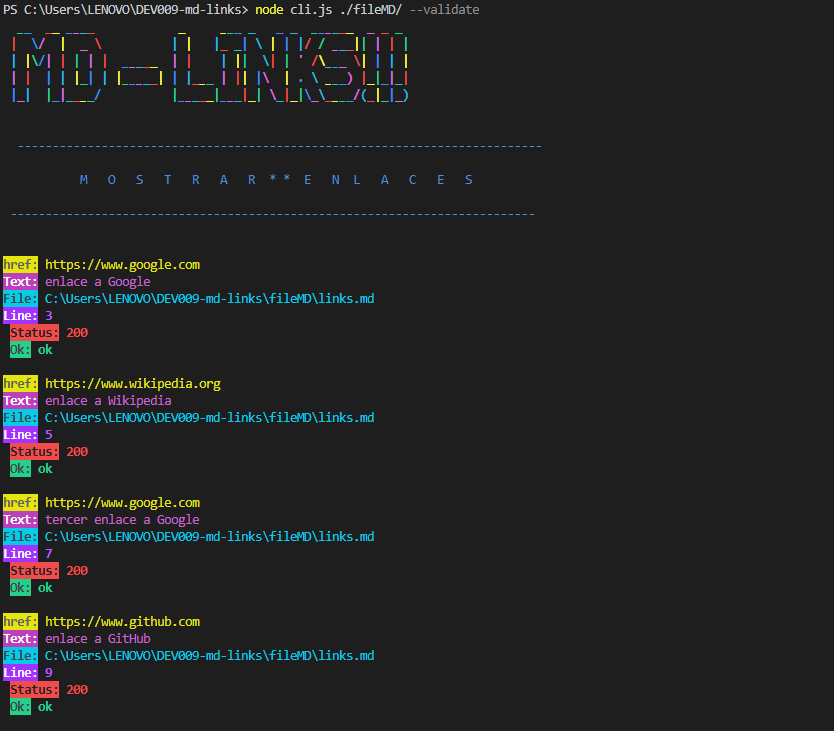

# Markdown Links

## 1. Introduccion 

[Markdown](https://es.wikipedia.org/wiki/Markdown) es un lenguaje de marcado
ligero muy popular entre developers. Es usado en
muchísimas plataformas que manejan texto plano (GitHub, foros, blogs, etc.) y
es muy común encontrar varios archivos en ese formato en cualquier tipo de
repositorio (empezando por el tradicional `README.md`).

Estos archivos `Markdown` normalmente contienen _links_ (vínculos/ligas) que
muchas veces están rotos o ya no son válidos y eso perjudica mucho el valor de
la información que se quiere compartir.

Dentro de una comunidad de código abierto, nos han propuesto crear una
herramienta usando [Node.js](https://nodejs.org/), que lea y analice archivos
en formato `Markdown`, para verificar los links que contengan y reportar
algunas estadísticas.

## 2. Planificación y Organización del proyecto

El proyecto consta de cinco etapas a desarrollar cada una cuenta con una tarea en especifico que permite complementarse una de otra. Siguiendo la metodología agil se utizo la herramienta de github proyect para ir planificando y organizando los temas a desarrollar de acuerdo a cada tarea.

### Tablero de Proyectos de GitHub (Github projects)

Se uso un board en github projects por etapa (hito), donde se dividen las responsabilidades en pequeñas tareas y asi poder reflejar un avance de acuerdo a cada etapa planificada.

Se utilizaron los elementos de milestone (historia de usuario) que en este caso fue por (hito). Tambien se agrego los issue de acuerdo a las tareas pequeñas y por ultimo las label que muestran el proceso de la tarea.

### Label:

* bloqueo: Se tenga una duda
* en proceso: Se esta ejecutando la tarea
* pendiente: Esta por realizarse la tarea
* realizado: Tarea terminada

Permitiendo optimizar la planificación de la tarea y la organizacion de la misma.

## 3. Desarrollo del proyecto

Dentro de las etapas del proyecto se utilizo algunas bibliotecas recomendadas para llevar a cabo el proyecto, entre las utilizadas son  `markdown-it` y  `cheerio` para realizar dos tareas clave: analizar archivos Markdown y encontrar enlaces dentro de ellos.

* `markdown-it` convierte el contenido Markdown en HTML, lo que nos permite buscar y extraer enlaces de manera más efectiva.

                      const md = markdownIt();
                   const html = md.render(line);

* `cheerio` busca y extrae enlaces dentro del HTML generado por `markdown-it`. Esto nos permite identificar los enlaces y extraer información importante, como la URL y el texto del enlace.

        const $ = cheerio.load(html);
        $('a').each((index, element) => {
          const href = $(element).attr('href');
          const text = $(element).text();
          // ... Procesa y almacena la información del enlace
        });

Ademá de busca y extrae los links, también se debía validar el status del enlace y para ello se utilizo la biblioteca `axios` para realizar una tarea fundamental: validar la disponibilidad y el estado de los enlaces encontrados en los archivos Markdown. `axios` es una biblioteca de JavaScript que nos permite realizar solicitudes HTTP y obtener información sobre las respuestas de los servidores web. En este contexto, lo utilizamos para verificar la existencia de los enlaces y determinar su estado.

## Etapas del proyecto

###  Hito 1

Dentro del Hito 1 se crea una promesa que permita leer archivos markdown y saber si existen links dentro de el.

### Pasos para resolver el hito 1:
1.	Transforma la ruta relativa a una ruta absoluta.
2.	Comprueba si la ruta existe.
3.	Verifica si el archivo es de tipo Markdown (según su extensión).
4.	Lee el contenido del archivo.
5.	Encuentra los links dentro del contenido Markdown.
6.	Resuelve la promesa con los links encontrados

### Hito 2

### Pasos para resolver el hito 2:
1.	Retornar el Arreglo de Objetos de Links con o sin propiedades adicionales, dependiendo de la validación.
2.	Agregar las propiedades status y ok a los objetos de link según la validación.
3.	Si validate es true, realizar solicitudes HTTP para validar cada link.
4.	Validar los Links
5.	Crear un Arreglo de Objetos de Links con las propiedades href, text, y file.
6.	Extraer Links (URL y Texto) de cada archivo markdown encontrado.
7.	Buscar y Analizar Archivos Markdown en la ruta especificada.
8.	Modificar la función mdLinks para incluir el parámetro validate.

### Hito 3

### Pasos para resolver el hito 3:
 1. Iniciar la Función mdLinks(path, validate)
 2.Verificar si la ruta path es relativa o absoluta
 3. Verificar si path es un archivo o un directorio
 4. Buscar y analizar el archivo Markdown.
 5. Extraer los links (href y text).
 6. Si validate es true:
 7. Realizar una solicitud HTTP para validar el link.
 8. Verificar si la solicitud HTTP fue exitosa.
 9. rear objeto con status y ok/fail.
 10. Si validate es false o undefined:
 11. Crear objeto href,text y file.
 12. Si es un directorio:
 13. Obtener la lista de archivos y subdirectorios en el directorio.
 14. Verificar si es un archivo Markdown (.md).
 15. Retornar el arreglo de objetos de links encontrados

### Hito 4

### Creacion del CLI (Interfaz de Linea de Comandos)

#### Comandos para ver el resultado de las estadísticas de acuerdo a la opcion seleccionada: 

* --validate
* --stats
* --validate--stats

# --validate

* Muestra el resultado de los links mediante un status HTTP.

# --stats

* Comando para ver el resultado de los links unicos encontrados en el archivo markdown y el total de links.

# --validate --stats

* Comando para ver el resultado de los links totales, unicos y rotos dentro del archivo markdown.

### Hito 5

* Busqueda entre directorios y subdirectorios para encontrar links dentro del archivo markdown.

### Manejo de Errores

* Buscar dentro de un directorio vacío

  C:\Users\LENOVO\DEV009-md-links> md-links ./pruebaMD
  Error: Directorio vacío. No se encontraron archivos Markdown en el directorio.

* Si el archivo no es markdown

  C:\Users\LENOVO\DEV009-md-links> md-links ./fileMD/archivo.txt
  Error: El archivo './fileMD/archivo.txt' no es un archivo Markdown.

## 4. Diagrama de Flujo

## 5. Instalación del paquete

Forma de instalación del paquete usando github.

        npm install github.com/abrilv29/DEV009-md-links

**Resultado de instalación del paquete**

## 6. Test Unitarios

Manejo de  pruebas unitarias de acuerdo a la función mdlinks y axios.

 **Elaborado por Abril Vargas - DEV009**
